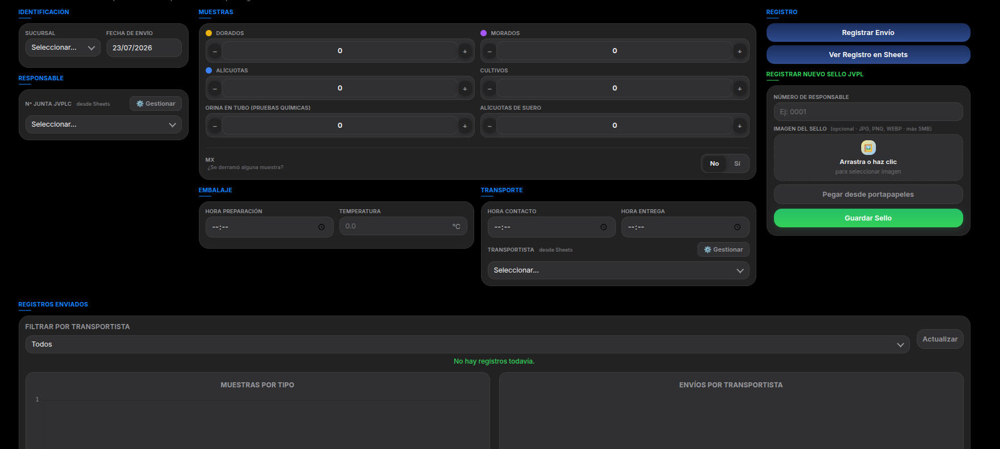
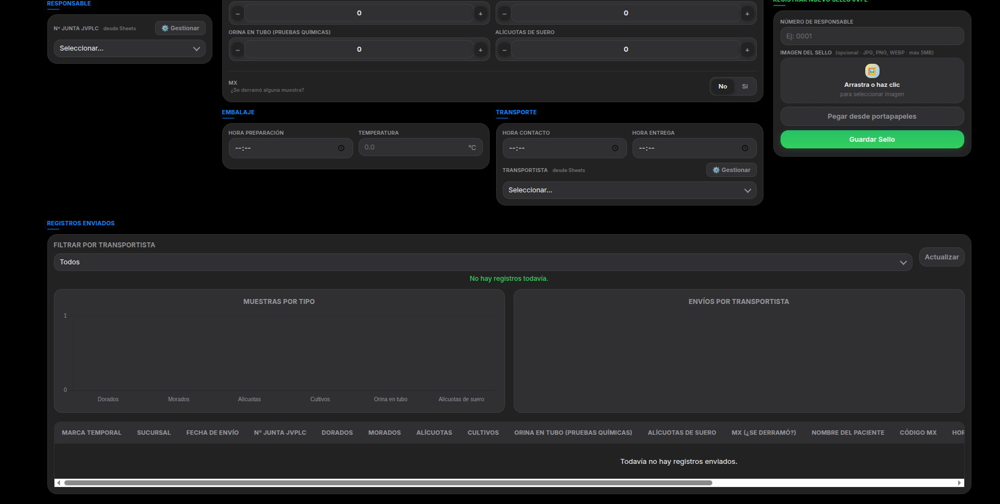

# TrackingWebApp

Una aplicación web responsiva desarrollada con **Google Apps Script**, diseñada para digitalizar, estandarizar y monitorear la logística de transporte de muestras de laboratorio.

### Características Principales:

* **Registro Integral de Cadena de Custodia:** Captura detallada de datos de identificación, sucursal, personal responsable (JVPLC), tiempos de preparación/entrega, control de temperatura y alertas de contingencias.
* **Carga y Gestión de Archivos:** Módulo integrado para el registro de sellos con soporte *drag-and-drop* y pegado desde el portapapeles, enlazado directamente con Google Drive.
* **Panel de Analítica en Tiempo Real:** Dashboard dinámico con gráficos interactivos que visualizan la distribución de muestras por tipo y el volumen de envíos por transportista.
* **Sincronización Automática:** Conexión directa con Google Sheets como base de datos para la actualización constante de listas desplegables y almacenamiento estructurado.

### Capturas:

